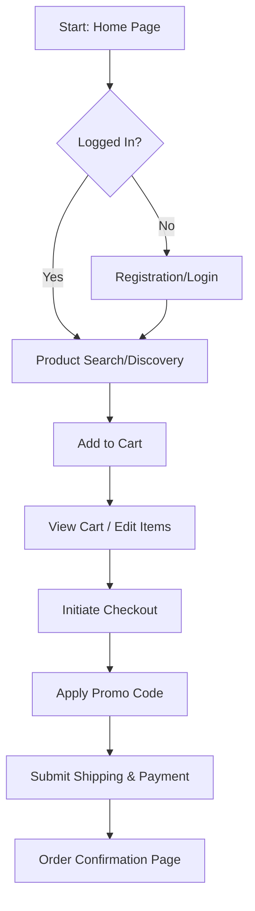

# E2E Test Strategy: Taqelah Demo Site

## Analysis of Existing Tests
- **`taqelah-login.spec.ts`**: Covers basic authentication (success/failure).
- **`taqelah-addtocart.spec.ts`**: Basic search and add-to-cart on desktop. Stops at the checkout form.
- **`checkout.spec.ts` (Regression)**: A serial execution test that covers the checkout modal and promo codes.

### Identified Gaps
- **User Registration**: No functional test for new user sign-up.
- **Cart Management**: Missing scenarios like removing items or updating quantities.
- **Full Checkout Completion**: No test currently validates the final "Order Confirmation" state after form submission.
- **Guest Checkout**: Current tests focus on authenticated users.

## Proposed "Happy Path" Scenarios

### 1. New User Registration & First Purchase
- **Journey**: Register -> Search -> Add to Cart -> Checkout -> Confirmation.
- **Value**: Validates the top of the funnel and account creation.

### 2. Multi-Item Product Discovery & Cart Management
- **Journey**: Search -> Add Item 1 -> Browse Collection -> Add Item 2 -> Remove Item 1 -> Checkout.
- **Value**: Ensures cart persistence and management logic works.

### 3. Authenticated Checkout with Promo Code
- **Journey**: Login -> Add to Cart -> Apply Promo -> Complete Checkout.
- **Value**: Verifies discount logic and bottom-funnel conversion.

## Architectural Approach

### Decision: Hybrid Strategy
- **Shared Authentication Context**: Use for **Product Discovery** and **Cart Management** tests to speed up execution.
- **Serial Execution for Checkout**: Use for the **Full Checkout Journey** (`taqelah-checkout-final.spec.ts`). This ensures that the multi-step modal (Shipping -> Billing -> Confirmation) is tested as a single, uninterrupted flow, which is more representative of real user behavior and easier to debug for state-heavy transitions.

## Core User Journey Flow

## Implementation Plan
1. Create `tests/functional/taqelah-registration.spec.ts`.
2. Create `tests/functional/taqelah-cart-management.spec.ts`.
3. Create `tests/functional/taqelah-checkout-final.spec.ts` (Serial Flow).
4. Update `tests/pages/CartPage.ts` if additional locators for removal/update are needed.

(This is the e2e test strategy of Roo Code, as it should be created under /plans/e2e-test-strategy.md)
